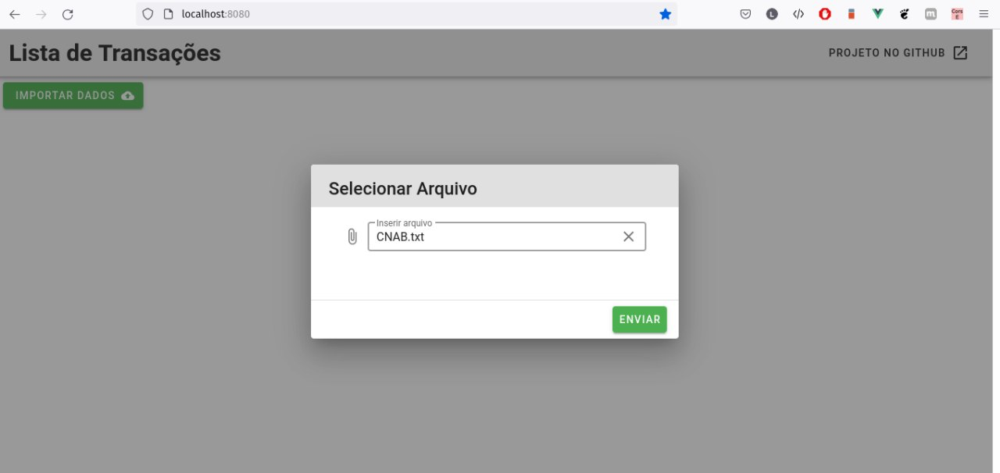
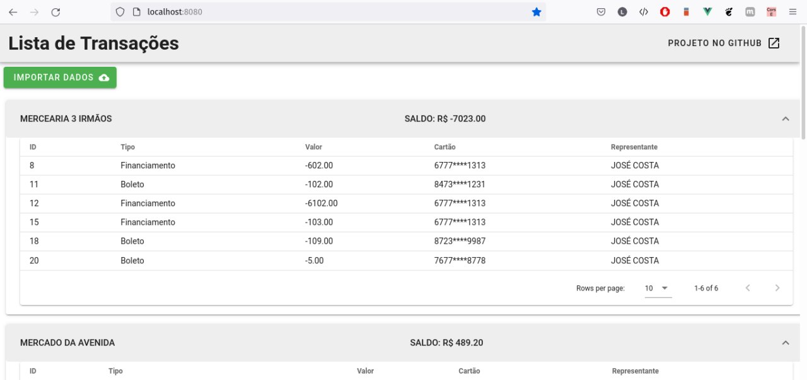
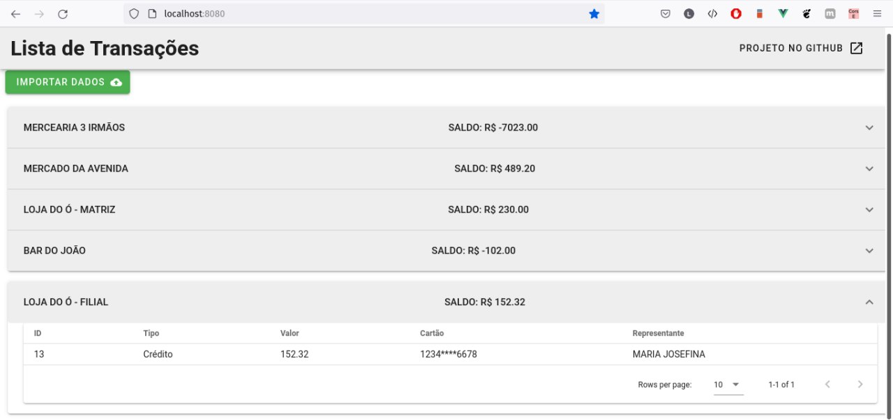

### Pré-requisitos
- docker-compose (versão 3)
- python3.8
- virtualenv
- node >= 12
- Portas "8000" e "8080" disponíveis para uso na máquina.

### Passo a passo com Docker Compose

1. Dentro da pasta principal do projeto, executar o comando `docker-compose up -d --build` para subir os containers. (Esse passo pode demorar um pouco, por conta do build das imagens)
    - Ao final do passo 1 é esperado que 3 containers estejam em execução (django_api, vue_ui e db_sistema)

5. Tudo ok. Acessar o projeto pelo endereço "http://localhost:8080".
    - http://localhost:8080 (tela inicial do sistema)

### Passo a passo sem Docker Compose

1. Na pasta 'client', executar `npm install` ou `yarn install` para instalar dependencias do client.
2. Após instalado, executar server com `npm run serve` ou `yarn serve`.
3. Criar um ambiente virtual do python na pasta raíz do projeto com o comando `virtualenv venv --python=python3.8`
4. Após criado o ambiente virtual e ativado (`source venv/bin/activate` para ativar), instalar as dependencias com `pip install -r api/requirements.txt`
5. Após concluído o passo 4, executar o comando `python manage.py migrate` para criar a estrutura inicial do banco de dados e o comando `python manage.py loaddata tipo_transacao.json` para popular o banco de dados com os tipos de transação definidas para o projeto.
6. Por fim, rodar o servidor da api com o comando `python manage.py runserver 0.0.0.0:8000`.
7. Tudo ok. Acessar o projeto pelo endereço "http://localhost:8080".
    - http://localhost:8080 (tela inicial do sistema)

### Telas do Sistema

1. Importação do arquivo

2. Lista de transações por loja

3. Lista de transações por loja - visão geral de lojas
